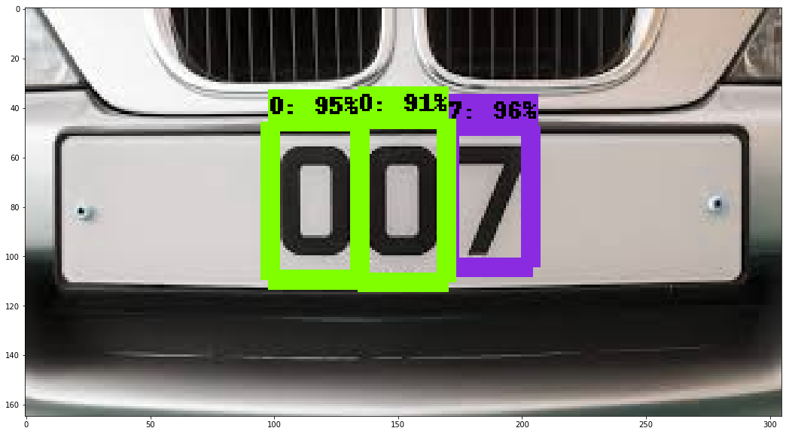
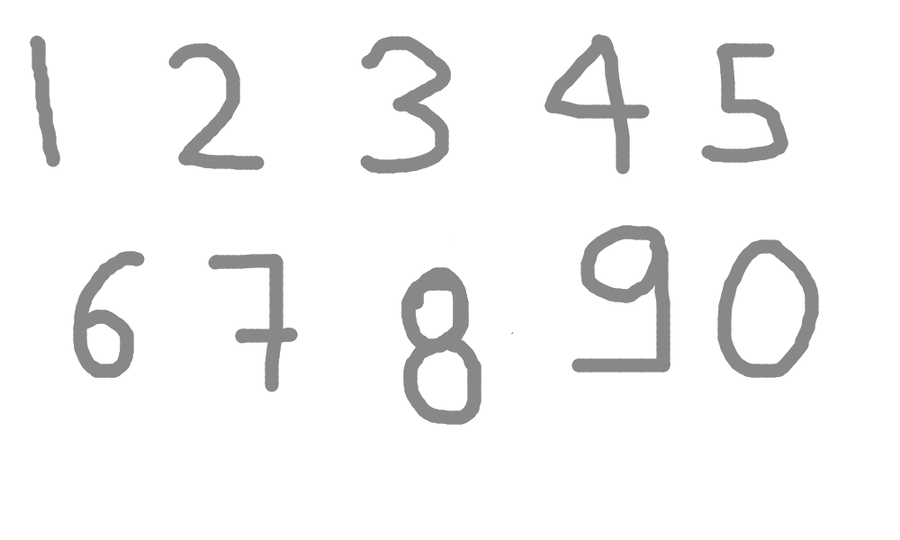
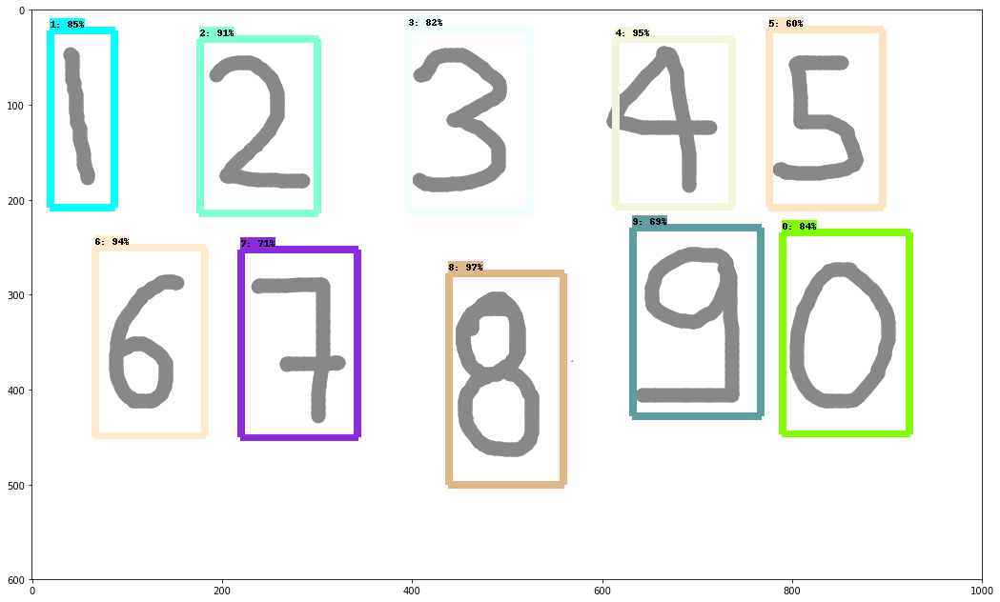

# RealTimeDigitDetectionAndRecognition

This project detects digits and recognize them using tensorflow object detection API. This project contains pre trained model
which have been trained on Google Colaboratory.

## Results

